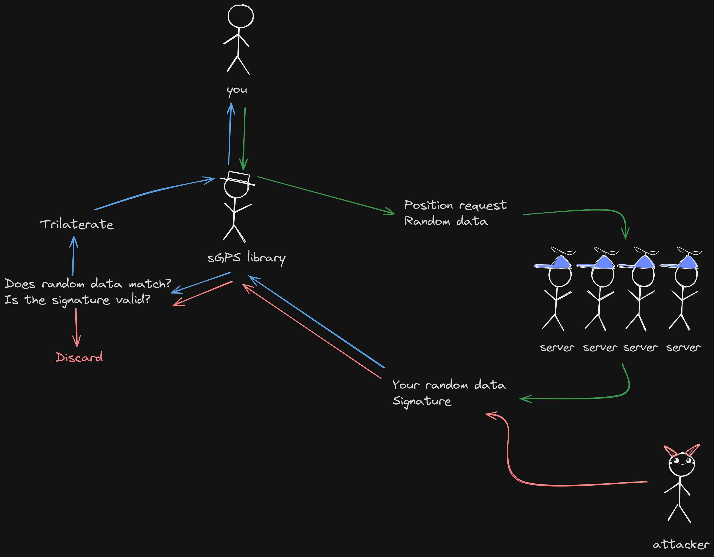

# sGPS

Secure and reliable [ComputerCraft](https://computercraft.cc) GPS for everyone!

## Constant use

> [!IMPORTANT]
> This is **NOT** intended for constant use!

Examples:
```diff
# green = correct usecase
# red   = incorrect usecase

+ turtle pings sGPS to get position on boot
- turtle pings sGPS to receive position on every move
```

## Technical details



sGPS uses ed25519 from [ccryptolib](https://github.com/migeyel/ccryptolib) to sign GPS packets once requested.
Each GPS request packet must contain random data, and the client must also store this data while waiting for responses.
The GPS server will sign your random data, and broadcast it back. Once received, the client verifies the random data and the signature.
